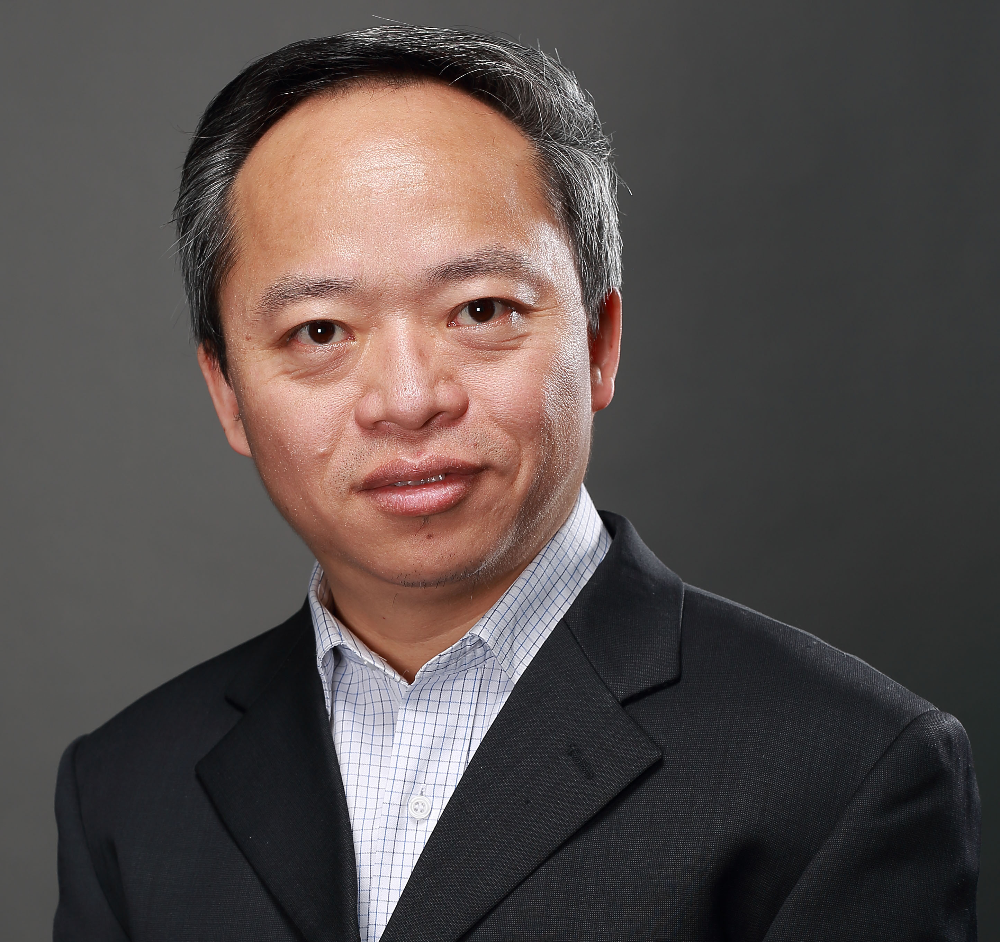

***
 
Dr. Jun Yang heads the Urban Ecology group within the Department of Earth System Science at Tsinghua University, China. His current research concentrates on methodologies for quantifying urban ecosystem services and their benefits to human well-being, monitoring and conserving urban biodiversity, and implementing nature-based solutions to improve urban climate resilience. Through these investigations, he seeks to comprehend the structure and functions of urban ecosystems to promote their sustainable management. 

## Reserach Interests

Urban ecosystem structure and functions, urban biodiversity, urban ecosystem services and human well being, urban forestry, urban nature-based solutions for climate change

## Academic Positions

2019-present  Tenured professor, Tsinghua University

2017-2018 Visiting Associate Professor, Cornell Laboratory of Ornithology

2013-2018 Associate professor, Tsinghua University  

2009-2012 Professor, Beijing Forestry University  

2005-2009 Assistant Professor, Temple University, United States

2005-2005 Visiting Postdoctoral Fellow, Yale School of Forestry & Environmental Studies

1994-1996 Assistant Researcher, Chinese Academy of Medical Science

## Education

1999-2004 PhD, Environmental Science, Policy and Management, University of California at Berkeley

1996-1999 M. Agr.  Landscape Plants, Beijing Forestry University

1990-1994 B. Agr. Forest Protection, Beijing Forestry University

## Selected Grants

2026-2029 A study on biodiversity patterns and the mechanisms of assembly and maintenance in urban forests across multiple scales. National Natural Science Foundation of China (PI)

2026-2030 Unraveling the socio-ecological effects of urban green infrastructure: Formation mechanisms and pathways for synergistic optimization. National Natural Science Foundation of China  (Co-PI)

2021-2025 Cascade effects of urbanization-driven biotic homogenization: an example of trees and birds. National Natural Science Foundation of China (PI)

2021-2024 Regreen: Fostering Nature-based Solutions for smart, green and healthy urban transitions in Europe and China. Ministry of Science and Technology of China, collaboration with European Union Horizon 2020 project (Co-PI)

2016-2019 The scale-dependence effect of the pattern and driving mechanism of biotic homogenization of urban plants. National Natural Science Foundation of China (PI)  

## Professional Services

### Editorial work

Associate editor, [Landscape and Urban Planning](https://www.sciencedirect.com/journal/landscape-and-urban-planning) (2026-2029)

Associate editor, [Urban Forestry and Urban Greening](https://www.sciencedirect.com/journal/urban-forestry-and-urban-greening) (2017-present)

Editorial member, [Landscape Architecture and Sustainability](https://www.sciencedirect.com/journal/landscape-architecture-and-sustainability) (2025-present)

Editorial member, [Landscape Architecture Frontiers](https://journal.hep.com.cn/laf/EN/home) (2023-present)

Editorial member, [Transactions in Earth, Environment & Sustainability](https://us.sagepub.com/en-us/nam/transactions-in-earth-environment-and-sustainability/journal203732) (2021-present)

Editorial member, [Biodiversity Science](https://www.biodiversity-science.net/CN/1005-0094/home.shtml) (2019-present)

Editorial member, [Landscape Architecture](http://lalavision.com/) (2017-present) 

Editorial member, [Journal of Chinese Urban Forestry](https://journals.caf.ac.cn/zgcsly/) (2015-present)

Editorial member, [Agricultural and Forest Meteorology](https://www.sciencedirect.com/journal/agricultural-and-forest-meteorology) (2016-2026)

### Affiliation

Deputy Chair, Digital Ecology Committee, Chinese National Committee of ISDE, (2024-)

Representative, IUCN Academy, (2020-)

Member, IUCN SSC Species Monitoring Specialist Group, (2019-)

Member, Steering committee of China Chapter, International Society of Urban Ecology, (2015-)

Member, Urban Ecology Committee, Ecological Society of China, (2012-), elected as deputy chair in 2018

