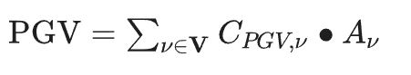
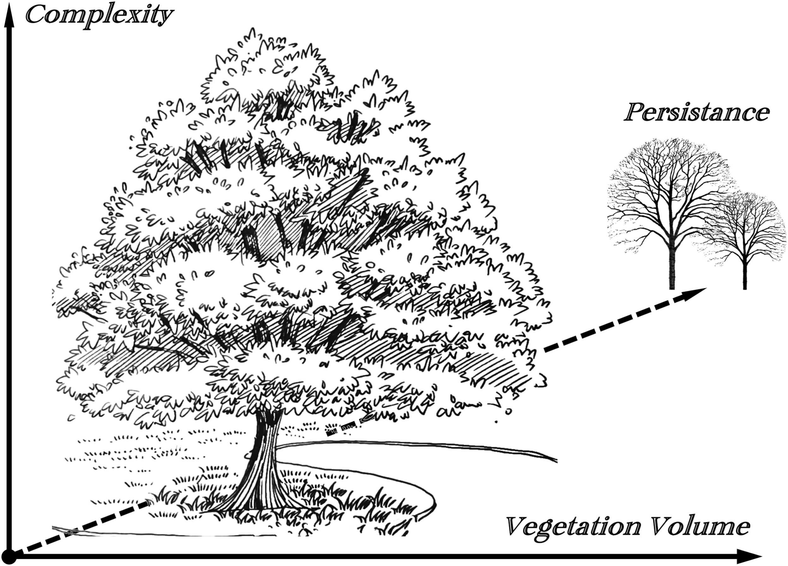
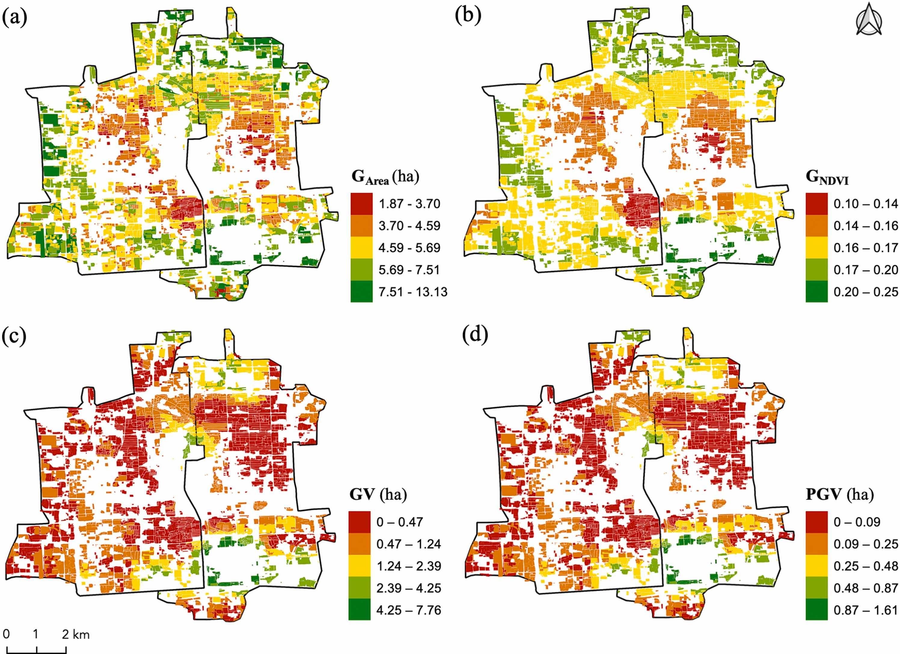

---
tags:
title: Perceived green volume
---
Urban greening in China is undergoing a transition from simply pursuing quantity to pursuing quality. How to enhance the sense of gain and satisfaction of urban residents has become an important goal of urban greening. These changes are driving the expansion of measurement indicators for urban green space from measuring objective physical quantities to measuring residents' subjective perceptions, providing usable tools to resolve the contradiction where the quantity of green space has surged, yet residents still feel a lack of greenery. Existing methods that incorporate subjective perceptions of green space, such as calculating the Green View Index, green preference scoring, and integrating usage frequency with perceived quality, are difficult to implement effectively in practice, either because the indicators are dimensionless or the calculation methods are complex. Therefore, this study plans to develop a green space quantitative indicator that incorporates subjective perceptions and can be integrated with urban greening work: Perceived Green Volume (PGV).

For residents to perceive green space, they must first have exposure to it. Based on different exposure pathways, this can be divided into two categories: one is unconscious exposure, where residents unconsciously see street green space or other green spaces while commuting to work or school, shopping, etc.; the other is conscious exposure, which is obtained by actively entering residential green spaces, parks, and other green areas. This type of exposure allows residents to experience green spaces through their five senses and has the greatest impact on their physical and mental health. Addressing the former, the research group developed a method to quantify the Green View Index in cities in 2009, based on the concept of "Green View" proposed by Japanese scholar Yoji Aoki (Yang et al., 2009, *Landscape and Urban Planning*, 91, 97-104. [Access the paper]([https://doi.org/10.1016/j.landurbplan.2008.12.004](https://doi.org/10.1016/j.landurbplan.2008.12.004 "Persistent link using digital object identifier"))). Therefore, this study focuses mainly on the latter.

To quantify green space for residents' conscious exposure, three factors need to be considered: (1) Residents must be able to use the green space; according to the situation in Beijing, this mainly refers to green spaces in the residential communities where residents live and parks; (2) It must be able to distinguish differences in exposure levels brought about by different vegetation structures, as the degree of exposure for residents in woods and grasslands is obviously different even for green spaces of the same area; (3) The indicator must have physical dimensions; dimensional indicators facilitate goal setting and adjustment through planning and design, and can be understood by management personnel. Based on the above considerations, the study proposes Perceived Green Volume (PGV): the volume of vegetation green that residents can perceive when consciously exposed to green spaces. Its specific calculation method is as follows:

Where Cpgv is the structure preception coefficent and Av is the area of green vegetation. This indicator uses the residential community as the calculation unit to calculate the PGV for each community. The distance involved is set as a 15-minute walking distance (900m) in this study, but can be determined according to residents' actual travel trajectories or the needs of planning departments. Vegetation types are obtained through classification based on high-resolution satellite imagery. Based on the characteristics of Beijing's urban vegetation and the features of remote sensing data, the study determined seven vegetation types: pure coniferous forest, mixed coniferous and broadleaf forest, deciduous broadleaf forest, shrubs, grassland, arbor-shrub mixture, and shrub-grass mixture. Therefore, the key to the research is obtaining the green space structure perception coefficients.

The study selected Dongcheng and Xicheng Districts in Beijing as the research area. First, Area of Interest (AOI) data for residential communities were obtained to determine the spatial scope of the communities. Then, based on deep learning methods, the Gaofen-2 satellite was classified to obtain land cover for the two districts (overall accuracy >80%), from which vegetation was extracted. The construction of the structure coefficients employed the Analytic Hierarchy Process (AHP), which allows for a good balance between subjectivity and objectivity. The indicator layer selected vegetation complexity, vegetation volume, and sustainability (Figure 1), based on a research review on how vegetation affects subjective perception.

Fig.1 Three features of vegetation used to construct the preceived structure coefficients.

The setting of weight coefficients was conducted through the expert scoring method. The study selected experts related to urban greening who work or study in the Beijing region or have experience there to distribute questionnaires. The experts scored how the three indicators affect the subjective perception of green volume for different vegetation types. Finally, 51 questionnaires were collected. The structure coefficients were calculated based on the questionnaire results.

To compare with existing indicators, the study selected common green space area, the Normalized Difference Vegetation Index (NDVI), and the area of residential green spaces and parks within a 900m range for comparison. Three policy scenarios were also set up to test the corresponding changes in Perceived Green Volume. These three scenarios are: (1) Baseline scenario, i.e., maintaining the status quo; (2) Scenario (a), the baseline scenario plus opening green spaces within various enterprises, public institutions, and organizations to residents; (3) Scenario (b), Scenario (a) plus opening internal green spaces within residential communities to non-residents.

The results show that the green space area within the 900m range or the area of community and park green space is far higher than the PGV (Figure 2). This indicates that after considering the impact of vegetation structure on residents' subjective perception of green volume, the green volume perceived by residents is discounted compared to the green volume in the physical sense.

Fig.2 Spatial variation of indicator values in residential areas. (a) Conventional indicator based on green space coverage area (GArea); (b) Conventional indicator based on NDVI (GNDVI); (c) Proposed green volume (GV); (d) Proposed perceived green volume (PGV).

The essence of Perceived Green Volume is the result of weighting and summing the green space area according to the vegetation structure upon it. Its main advantages are that it is easy to understand, and it balances subjective perception and objective physical quantities as much as possible during construction, ensuring scientific rigor and operability. Its operability in assisting urban greening management can be demonstrated through the following example. For instance, for a 1,000 square meter lawn, the PGV calculated according to the structure coefficient table is: 1000 * 0.048 = 48 square meters. If half of it is transformed into a mixed coniferous and broadleaf forest, the PGV becomes: 500 * 0.277 + 500 * 0.048 = 162.5 square meters, an increase of 3.4 times. It should be noted that the structure coefficients of PGV are only applicable to cities with the same vegetation structure. The structure coefficient table constructed in this paper is only applicable to Beijing and cities with similar vegetation structures in the surrounding areas. It needs to be reconstructed when used in other cities. At the same time, this study only considered three main vegetation structure factors; other structural factors may also influence the subjective perception of green volume. Future research can further expand and refine these factors.

For more information, please read our paper:
Zhang, YT., Sun ZL., John, SJ., Li, XY., Yang, J*. (2026).  Measuring perceived green volume for quantifying urban green exposure.  Urban Forestry & Urban Greening, 16, 129231.  https://doi.org/10.1016/j.ufug.2025.129231 

Back to [home](index.md)
