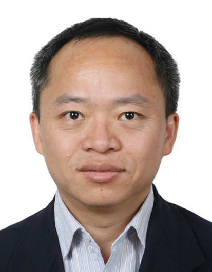
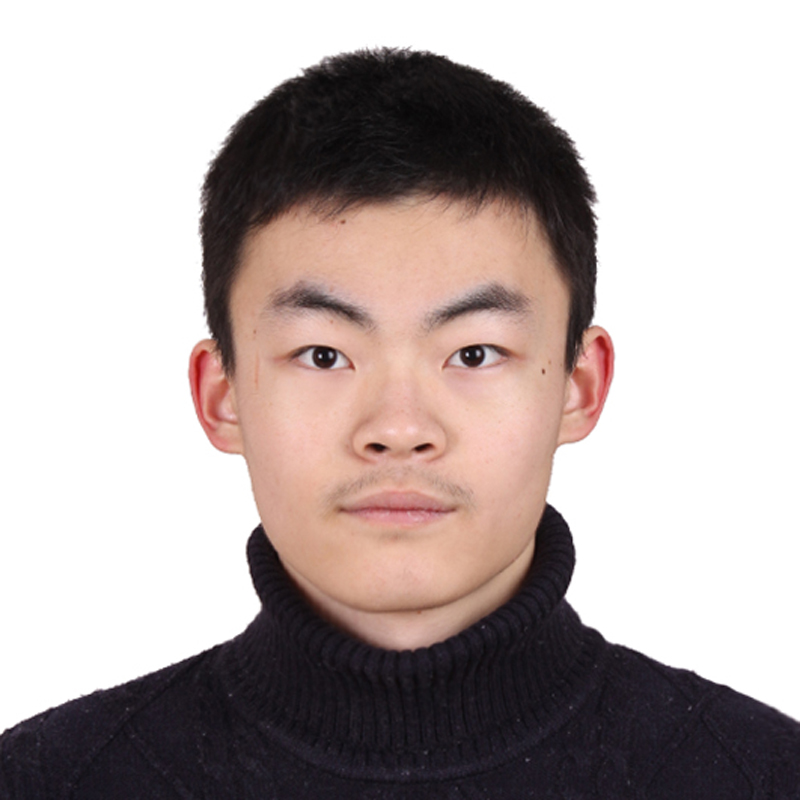
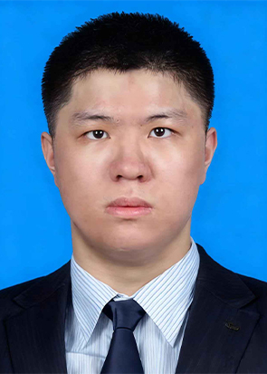
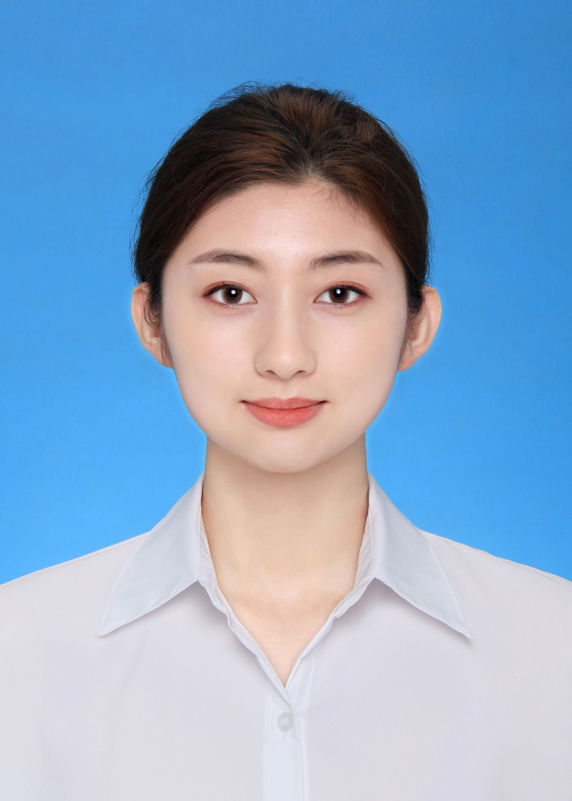
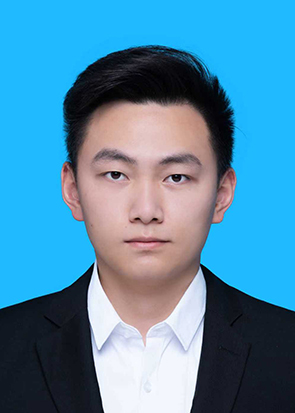
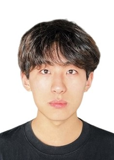

***
## Team Leader  

 Dr. Jun Yang        

Email: larix(at)tsinghua.edu.cn  

Research interests: Urban ecosystem structure and functions, urban biodiversity, urban ecosystem services and human well being, urban forestry, Nature-based solution  

***
## Postdoctoral fellow  

 Dr. Han Yan    

Email: yan_han(at)tsinghua.edu.cn  

Research interests: Urban insects and interaction networks of pollinators and plants

***
## PhD candidate  

 Ziyi Guo       

Email: guozy21(at)mails.tsinghua.edu.cn   
Research interests: Social-ecological impacts of mining Licor in Chile  

***
 Zemin Feng        

Email: fengzm22(at)mails.tsinghua.edu.cn

Reserach interests: Historical patterns of global urbanization 

***
 Xinyi Liu   

Email: liu-xy22(at)mails.tsinghua.edu.cn

Research interests: Avian frugivory in urban environments

***
 Yue Ma   

Email: ma-y22(at)mails.tsinghua.edu.cn

Research interests: Urban infrasructure and urban resilience

***
 Xudong Yang  

Email: yangxd23(at)mails.tsinghua.edu.cn

Research interests: Biotic homogenization in global urban environments

***
 Zhelun Sun    

Email: sunzl23(at)mails.tsinghua.edu.cn

Research interests: AI and urban remote sensing

***
 Xuanhong Zhou   

Email: zhou-xh24(at)mails.tsinghua.edu.cn

Research interests: AI and urban biodiversity

***
 Jing Zhou   

Email: j-zhou25(at)mails.tsinghua.edu.cn

Research interests: Urban avian diversity and land use/land cover

***
 Jialin Li   

Email: 

Research interests: Ecological, social, and economic impacts of urbanization

***

## Lab alumni

### Visiting Scholars

Weichong Fu (2024), Xiao Tao (2023)

### Postdoctoral Fellows

Linwei Han (2022), Gaochao Zhang (2021) 

### PhD Students

 Yutong Zhang (2026), Yuzhi Zhang (2024), Xiangyu Luo (2022), Siran Lu (2022), Boyu Gao (2022), Jingyi Yang (2021), Jing Jin (2020), Conghong Huang (2020), Pengbo Yan (2018), Guanghui Dai (2018), Wenjuan Zhang (2016), Rongxiao He (2016) 

### Master Students

Danqi Xin (2020), Peng Jiang (2019), Huakui Liu (2019), Chong Nie (2016), Yiwen Guan (2016), Suli Li(2015), Yamin Chang (2015), Zhiyong Zhang (2014), Conghong Huang (2014), Feng Guo(2014), Fengyu Bao (2013), Juan Zhao (2013)  