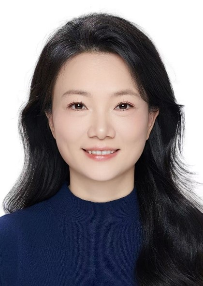
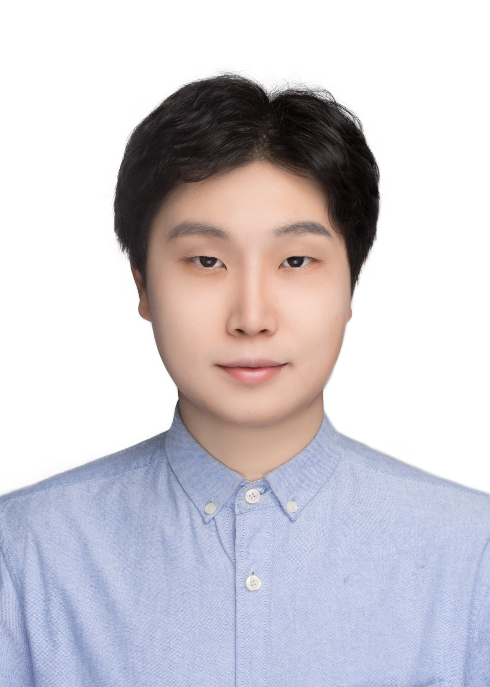
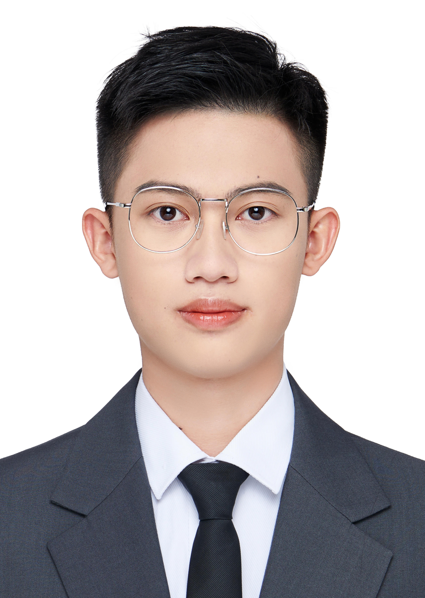
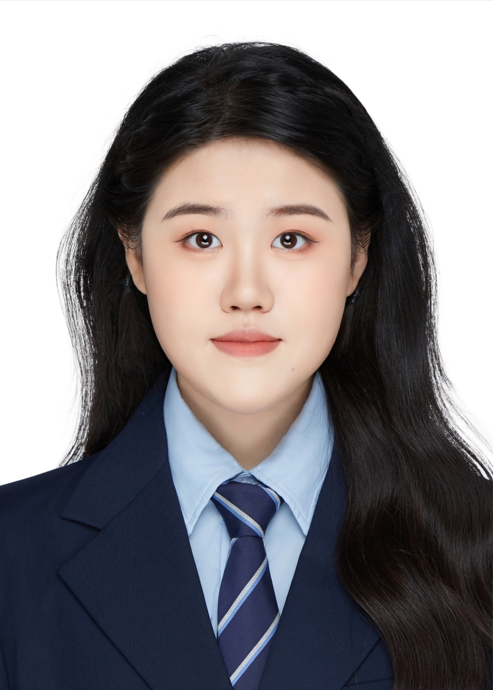

***
## Team Leader  

 Dr. Jun Yang        

Email: larix(at)tsinghua.edu.cn  

Research interests: Urban ecosystem structure and functions, urban biodiversity, urban ecosystem services and human well being, urban forestry, Nature-based solution  

***
## Visiting scholar

 Dr. Wenjuan Zhang    

Email: zhangwenyi111(at)126.com  

Research interests: Cultural ecosystem services, conservation and revitalization of cultural and natural heritage

*** 
## Postdoctoral fellow  

 Dr. Han Yan    

Email: yan_han(at)tsinghua.edu.cn  

Research interests: Urban insects and interaction networks of pollinators and plants

***
## PhD candidate  

 Ziyi Guo       

Email: guozy21(at)mails.tsinghua.edu.cn   
Research interests: Social-ecological impacts of mining Licor in Chile  

***
 Zemin Feng        

Email: fengzm22(at)mails.tsinghua.edu.cn

Reserach interests: Historical patterns of global urbanization 

***
 Xinyi Liu   

Email: liu-xy22(at)mails.tsinghua.edu.cn

Research interests: Avian frugivory in urban environments

***
 Yue Ma   

Email: ma-y22(at)mails.tsinghua.edu.cn

Research interests: Urban infrasructure and urban resilience

***
 Xudong Yang  

Email: yangxd23(at)mails.tsinghua.edu.cn

Research interests: Biotic homogenization in global urban environments

***
 Zhelun Sun    

Email: sunzl23(at)mails.tsinghua.edu.cn

Research interests: AI and urban remote sensing

***
 Xuanhong Zhou   

Email: zhou-xh24(at)mails.tsinghua.edu.cn

Research interests: AI and urban biodiversity

***
 Jing Zhou   

Email: j-zhou25(at)mails.tsinghua.edu.cn

Research interests: Urban avian diversity and land use/land cover

***
 Jialin Li   

Email: 

Research interests: Ecological, social, and economic impacts of urbanization

***

## Lab alumni

### Visiting Scholars

- Weichong Fu (2024), Fujian Agricultural and Forestry University, Fujian, China  
- Xiao Tao (2023), Anhui Agricultural University, Anhui, China  

### Postdoctoral Fellows

- Linwei Han (2022), University of Chinese Academy of Sciences, Beijing, China
- Gaochao Zhang (2021), Southeast University, Jiangsu, China

### PhD Students

 - Yutong Zhang (2026), China Institute of Nuclear Information and Economics, Beijing, China
 - Yuzhi Zhang (2024), Jiangxi Provincial Department of Ecology and Environment, Jiangxi, China
 - Xiangyu Luo (2022), Sichuan Provincial Bureau of Forestry and Grassland, Sichuan, China
 - Siran Lu (2022), Shanghai Academy of Landscape Architecture Science and Planning, Shanghai, China
 - Boyu Gao (2022), Beijing Fifth High School, Beijing, China
 - Jingyi Yang (2021), Guizhou University, Guizhou, China
 - Jing Jin (2020), Jiangsu Academy of Agricultural Sciences, Jiangsu, China
 - Conghong Huang (2020), Nanjing Agricultural University, Jiangsu, China
 - Pengbo Yan (2018), Guilin Tourism College, Guangxi, China
 - Guanghui Dai (2018), Yunnan Academy of Forestry and Grassland, Yunnan, China
 - Wenjuan Zhang (2016), Jiangxi Normal University, Jiangxi, China
 - Rongxiao He (2016), Hainan University, Hainan, China 

### Master Students

- Danqi Xin (2020), Pricewaterhouse Coopers, Shanghai, China
- Peng Jiang (2019), Meituan, Beijing, China
- Huakui Liu (2019), Beijing, China
- Chong Nie (2016), Chinese Research Academy of Environmental Science, Beijing, China
- Yiwen Guan (2016), State Forestry and Grassland Administration, Beijing, China
- Suli Li (2015), Zhong Gong Educational Tutoring Institution, Beijing, China
- Yamin Chang (2015), Quantum Data, Beijing, China
- Zhiyong Zhang (2014), Chinese Academy of Forestry, Beijing, China
- Conghong Huang (2014), same as above
- Feng Guo(2014), Beijing Xinhangcheng Smart Ecological Technology Research Institute Co., Ltd. Beijing, China
- Fengyu Bao (2013), China Academy of Urban Planning & Design, Beijing, China
- Juan Zhao (2013),  Dingbian Forestry Bureau, Gansu, China