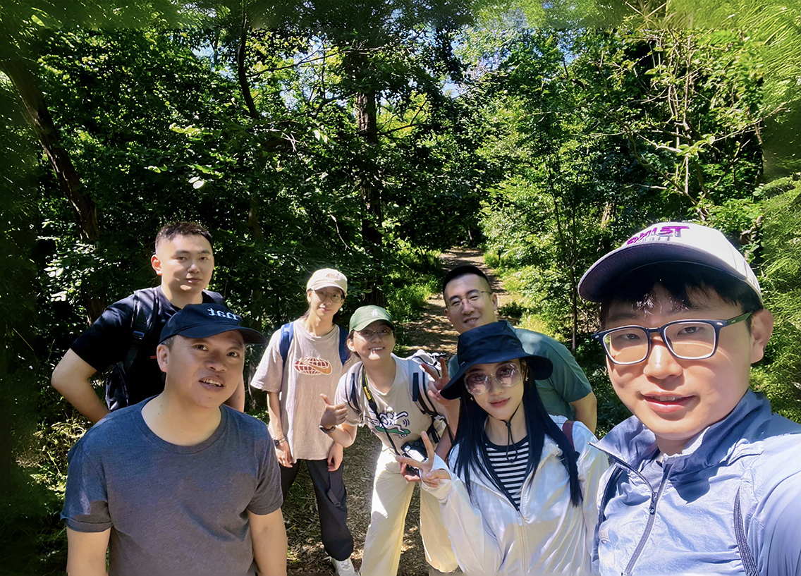

### Welcome to the Yang Lab at Tsinghua University, Beijing, China

The **Yang Lab** is committed to promoting urban sustainability and livability through comprehensive ecological research. By integrating **field work** with **AI, big data, and remote sensing**, we investigate the intricate interactions between constructed environments and natural systems across four principal themes.

### 1. Urban Ecosysystem Structure and Functions

We examine the manner in which the physical and socio-economic composition of urban areas interacts with ecological processes.

* **Example works:** Analyzing the **ecological, social, and economic impacts of urbanization** and mapping the relationship between **urban carbon emission** and **land use/land cover** change.

### 2. Urban Ecosystem Services and Human Well-being

Our research quantifies the tangible benefits that nature provides to city dwellers.

* **Example works:** Assessing the role of **urban green infrastructure** in climate regulation and its impacts on **human health** and **overall well-being**.

### 3. Urban Biodiversity

We utilize cutting-edge technology to monitor and protect biodiversity in human-dominated landscapes.

* **Example works:** Applying **AI and urban remote sensing** to track **urban biodiversity** and developing **policies and tools** essential for **urban biodiversity conservation**.

### 4. Nature-Based Solutions for Urban Resilience

We focus on how natural elements in urban ecosystems can be leveraged to protect cities from environmental stressors.

* **Example works:** Designing **Nature-based solutions** that strengthen **urban resilience** and exploring the intersection of biological systems and sustainable infrastructure.

By bridging the gap between built environment science and urban ecology, we provide the evidence-based insights necessary to build resilient, biodiverse, and healthy cities for the future.

We have opportunities for postdoctoral fellowships and research assistant positions. Please send us a message and your CV if you are interested.  

Contact: Dr. Jun Yang  
Email: **larix(at)tsinghua.edu.cn**;  **larix001(at)gmail.com**  
Profiles: [Lab Homepage](http://faculty.dess.tsinghua.edu.cn/yangjun/en/index.htm);  [Google Scholar page](https://scholar.google.com/citations?user=Q6TkqvkAAAAJ&hl=en); [ResearchGate](https://www.researchgate.net/profile/Jun-Yang-30?ev=hdr_xprf)

